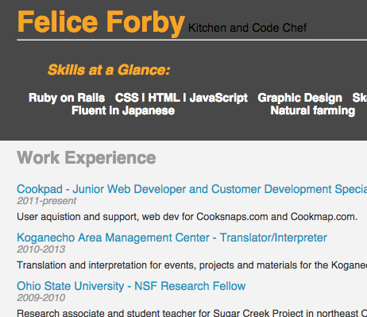

# The Resume Project
Building an interactive resume using JavaScript, jQuery and JSON for the Udacity Front-End Developer Nanodegree.

## Skills learned during this project

1. Manipulating the DOM with JavaScript and jQuery.
2. Creating and using data with JSON
3. Working with HTML and CSS
4. Creating interactive Google Maps using custom data

### By the end:

